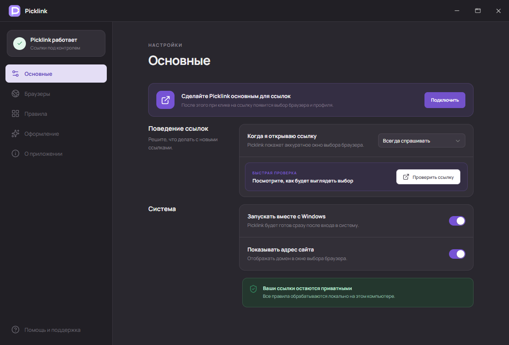
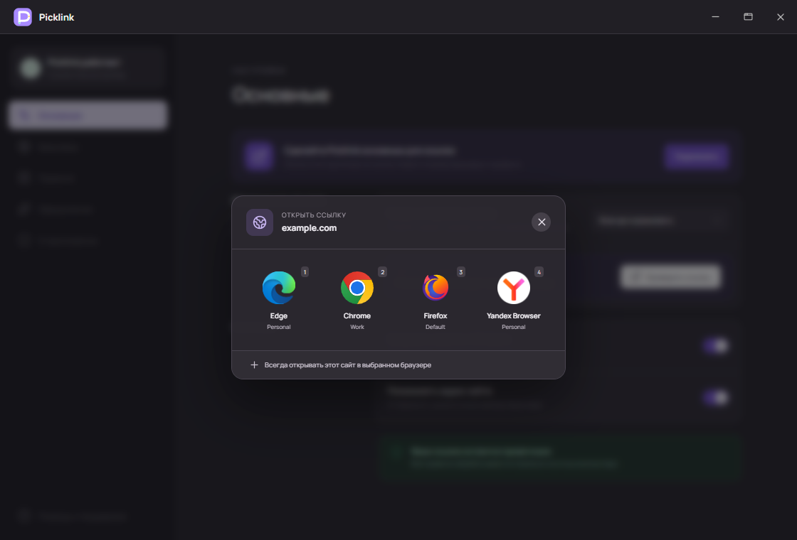
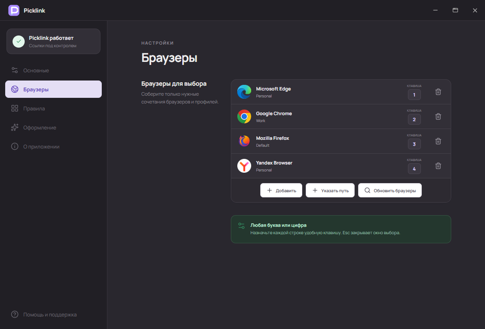

# Picklink

> Pick the right browser and profile for every link on Windows.

[Русский](#русский) · [English](#english)



## Русский

Picklink открывает каждую ссылку в подходящем браузере и профиле Windows. Рабочие сервисы можно отправлять в рабочий профиль, личные сайты — в личный, а неизвестные ссылки — выбирать вручную.

### Выберите браузер сами

Вместо автоматического запуска браузера по умолчанию Picklink показывает компактное окно выбора. Нажмите на браузер мышью или используйте назначенную клавишу — например, `1` для рабочего Edge и `2` для личного профиля того же браузера.



### Или позвольте Picklink выбрать

Правила направляют знакомые сайты сразу в нужный браузер. Например, ссылки на рабочую почту можно всегда открывать в рабочем профиле, а видеозвонки — в браузере с нужной учётной записью. Для остальных ссылок окно выбора останется доступным.

### Отдельные профили браузеров

Один браузер можно добавить в список несколько раз с разными профилями и клавишами. Picklink обнаруживает профили Chromium-браузеров, Firefox, Waterfox и LibreWolf. Если браузер не найден автоматически, укажите путь к его `.exe` — он сразу появится в списке.



### Создано для Windows

Picklink регистрируется как обработчик HTTP и HTTPS, следует системной светлой или тёмной теме и автоматически выбирает язык Windows. Настройки и правила хранятся локально; адреса открываемых ссылок не отправляются на внешние серверы.

### Установка

1. Скачайте `Picklink Setup 1.0.0.exe` на странице [Releases](../../releases).
2. Установите приложение.
3. На странице «Основные» нажмите «Подключить» и назначьте Picklink приложением для HTTP и HTTPS.

### Разработка

```bash
npm install
npm run dev
```

Сборка установщика: `npm run dist`.

## English

Picklink opens every link in the right Windows browser and profile. Send work services to your work profile, personal websites to your personal profile, and choose what to do with everything else.

### Pick a browser yourself

Instead of immediately using the default browser, Picklink shows a compact picker. Click a browser or press its assigned key — for example, `1` for a work Edge profile and `2` for a personal profile in the same browser.


### Or let Picklink choose

Rules route familiar websites straight to the browser you want. Always open work mail in your work profile, or video calls in the browser containing the right account. Unknown links can still show the picker.

### Browser profiles

Add the same browser more than once with different profiles and keyboard shortcuts. Picklink discovers profiles from Chromium browsers, Firefox, Waterfox, and LibreWolf. If a browser is not detected, select its `.exe` file and it will be added immediately.


### Made for Windows

Picklink registers as the HTTP and HTTPS handler, follows the Windows light or dark theme, and automatically detects the system language. Settings and rules stay on your computer; opened URLs are not sent to external servers.

### Installation

1. Download `Picklink Setup 1.0.0.exe` from [Releases](../../releases).
2. Install the app.
3. Open General, click Connect, and assign Picklink to HTTP and HTTPS.

### Development

```bash
npm install
npm run dev
```

Build the Windows installer with `npm run dist`.

## Author

Created by [@marilynje](https://github.com/marilynje).
