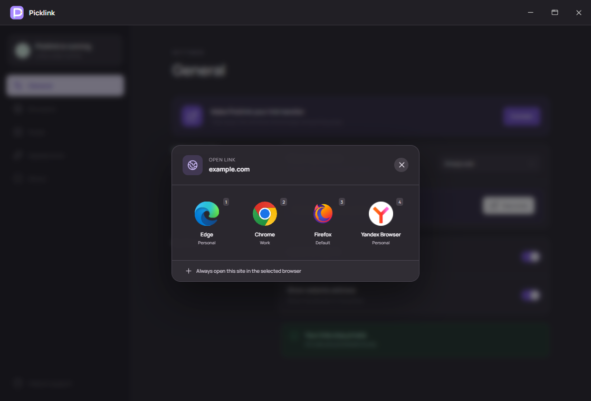
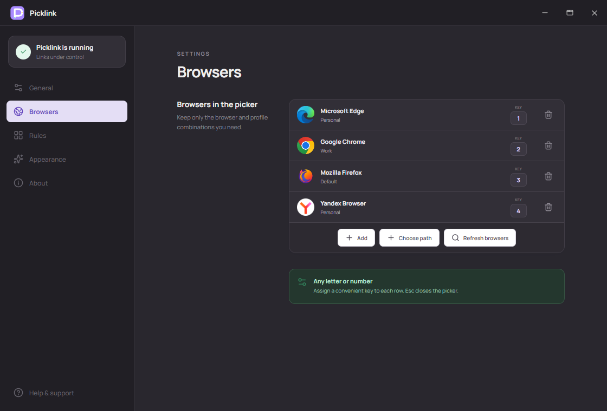

# Picklink

Pick the right browser and profile for every link on Windows.

Picklink can:

- show a compact browser picker for HTTP and HTTPS links;
- open links in separate browser profiles;
- assign any letter or number to a browser/profile combination;
- route websites automatically with local rules;
- detect installed browsers or add one by its `.exe` path;
- follow the Windows theme and interface language.

## Download

Download **Picklink 1.0.1** from [GitHub Releases](https://github.com/marilynje/picklink/releases/latest).

Windows 10 and 11 · Settings and rules stay on your computer.

Created by [@marilynje](https://github.com/marilynje).
